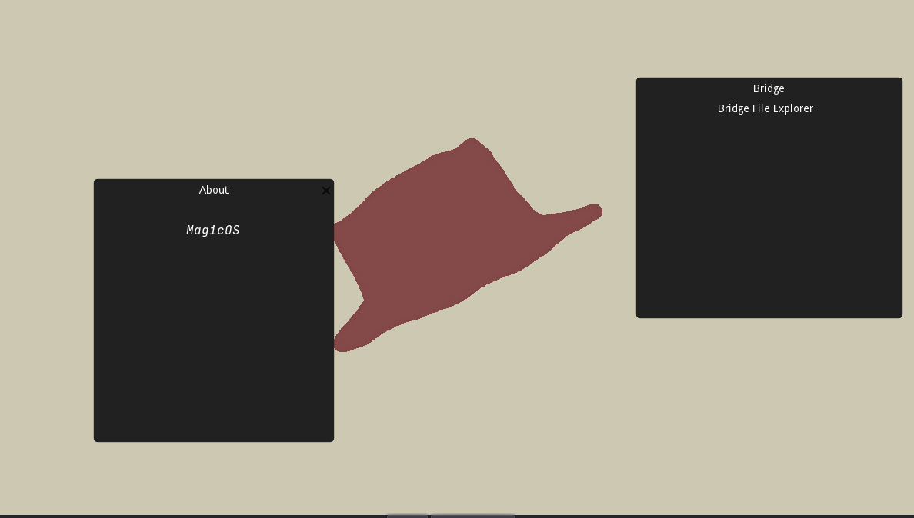

# MagicOS

MagicOS is a Godot-based "Operating System"

### The purpose of "MagicOS" is to research different methods of user interaction.

Review [Components](#components) for a list of different components.

## Components

### G11 - Window Themes

G11 is the theme that's builtin for Windows. There is no customizations yet.

### Application Manager

There is a builtin application manager for MagicOS. This loads Windows (and soon games.)

### Instruction video

You can watch the instruction video by opening the application. It tells you everything you need to know, and more.

### External Applications

You can use apps from files since MagicOS Black Release 2, which implements home apps by using the local filesystem.

### Window Titles

If you don't supply a window name, then the application will try to guess it, by using the Application's code-name (Button name)

## Features

👍

- Basic OS UI (Including `WindowDialog`s, user interactions, etc...)
- Modular Filesystem (Everything is separated and neat)
- Godot Engine (yes)
- Working system (Interactive)
- Time (System time, etc ...)
- GSYSHAT for system variables
- Hatpad for text editing
- 3D sample apps
- Customizable time
- Applications (Using SnapPak)
- Home directory
- Vintage tapes for learning (Click on the Analog Viewer)

⚠️

- 3D support (A W.I.P, support will be finished in the near future.)
- Dynamic tapes (Currently, you can only use what is supplied to you.)
- About MagicOS application
- Network interface (Not much you can do from an application standpoint!)
- Users

❌

- WWW (World Wide Web) support. (In construction)
- Console (for system calls)
- NFy (For listening to music within MagicOS)
- Terminal Emulator (Also falls under "Console")
- Internationalization
- Interactive OS setup / Tutorial (Easy to implement, not a priority.)

🐛

- App Duplication (multiple local apps)
